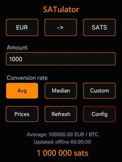

# SATulator

SATulator is a compact ESP32-2432S028 (2.8-inch CYD) Bitcoin/fiat converter built with PlatformIO, LVGL, and TFT_eSPI. It fetches configured public exchange prices when Wi-Fi is available, calculates average and median rates, and preserves downloaded rates plus board preferences in flash.



The startup screen shows the orange Bitcoin logo, SATulator title, project description, MIT license, and copyright information before the conversion interface loads.

## Features

- Live HTTPS exchange rates with configurable source lists for EUR, USD, CHF, GBP, and JPY
- Average, median, and editable custom conversion rates
- NTP-synchronized refresh timestamps when Wi-Fi is connected
- Full-screen source-price table and BTC/satoshi conversion modes
- Saved-rate-only Prices page: a fiat with no saved download displays `0.00`
- Persisted last fiat, direction, BTC/satoshi unit, rate selection, custom rate, and amount
- Configuration statistics for rate payload, board-state payload, and cumulative saved data

## Build and flash

```sh
pio run -t upload
pio device monitor
```

Firmware artifacts produced by GitHub Actions include a complete Linux flash bundle. Extract it, ensure `esptool` is installed (`python3 -m pip install esptool`), then run:

```sh
./flash-firmware-linux.sh /dev/ttyUSB0
```

Use the serial device shown for your board, commonly `/dev/ttyUSB0` or `/dev/ttyACM0`. If automatic upload reset does not work, hold **BOOT** while the command begins.

Alternatively, you can flash the board from your browser with [DIY Flasher](https://valerio-vaccaro.github.io/diyflasher/). Select the SATulator firmware files from the release artifact and follow its on-screen serial-port instructions.

## Using the converter

- **Fiat** cycles through EUR, USD, CHF, GBP, and JPY.
- **Arrow** changes between fiat-to-bitcoin and bitcoin/satoshi-to-fiat conversion.
- **BTC / SATS** selects the Bitcoin unit. Tap **Amount** to enter a number.
- **Avg**, **Median**, and **Custom** choose the rate used for conversion; Custom opens an editor for a manually entered rate.
- **Prices** shows saved source rates, **Refresh** downloads the active fiat, and **Config** provides device-wide actions.

Rates are expressed as fiat currency per 1 BTC. With a EUR/BTC rate of `100000`, entering `1000` EUR produces `1 000 000 sats`.

## Network and offline operation

On first start, SATulator creates the Wi-Fi setup network **SATulator-Setup**. Join it and open `192.168.4.1` to provide Wi-Fi credentials. You can skip setup and work offline: saved rates, currency, direction, unit, rate choice, custom rate, and last amount persist in flash. A fiat without a saved download appears as `0.00` on the Prices page.

## CI and documentation

GitHub Actions builds the `esp32-2432s028` firmware on every push and pull
request, then exposes the binary, ELF, and linker map as downloadable workflow
artifacts for 30 days. Pushes to the default branch also publish the static
documentation in `docs/` through GitHub Pages.

The interface uses **fiat currency per 1 BTC** (for example, `100000`). Tap an input to open the numeric keypad. The arrow button switches between fiat-to-BTC/satoshi and BTC/satoshi-to-fiat conversions.

Changing fiat never downloads data automatically. Press **Refresh** for the active fiat or **Refresh all** in Configuration to download and save new rates.

## Hardware configuration

The bundled PlatformIO environment targets the common ESP32-2432S028R board with the original module visibly marked **ESP-32S**: an ILI9341 display, XPT2046 resistive touch controller, and a 240×320 portrait display. It uses the fixed XPT2046 portrait mapping defined in `src/main.cpp`.

It does not support unchanged capacitive-touch `S028C`, ESP32-S3, or ST7789-display variants.

## Inspiration

SATulator is inspired by [btcpos](https://github.com/RCasatta/btcpos) and [fiat-converter](https://github.com/damianobonazzi/fiat-converter).

## License and copyright

SATulator is released under the [MIT License](LICENSE).

Copyright © 2026 Valerio Vaccaro.
